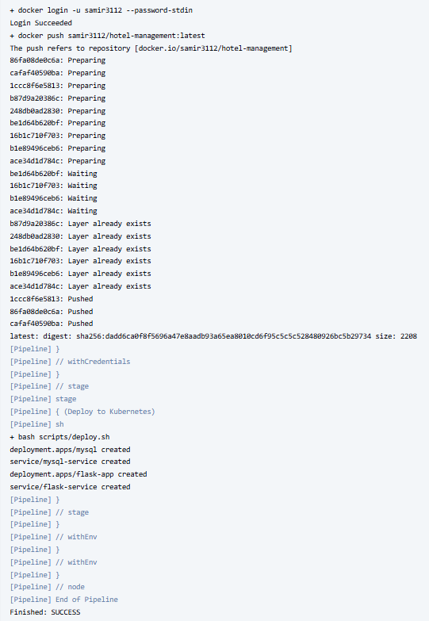
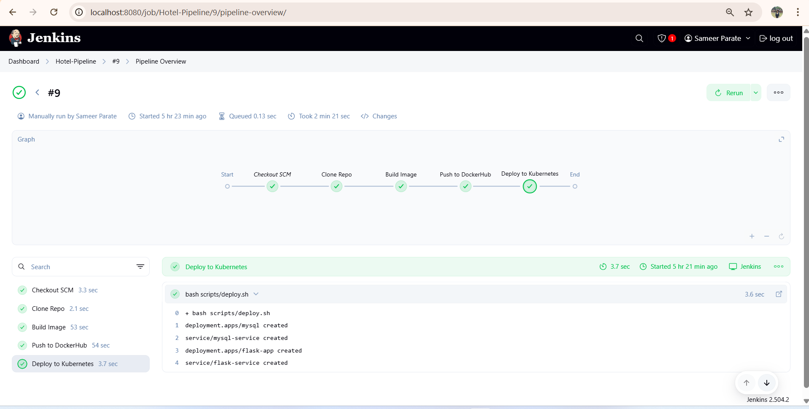
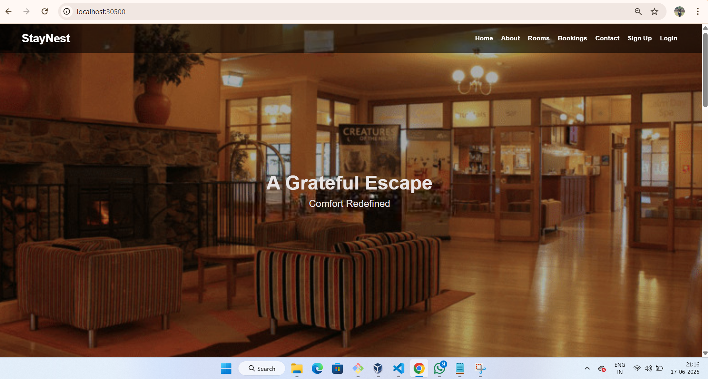
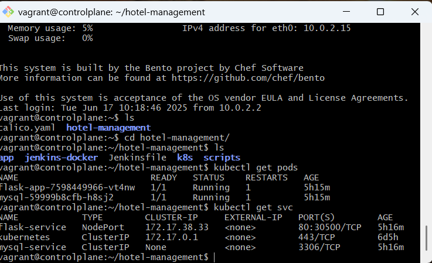

# 🏨 Hotel Management System (Docker + CI/CD + Kubernetes + Jenkins)

A full-stack hotel management system deployed with **Docker**, **Kubernetes**, and fully automated with **Jenkins CI/CD**. Built with **Flask** and **MySQL**.

---

## 🔧 Technologies Used

| Tool                 | Purpose          |
| -------------------- | ---------------- |
| Python (Flask)       | Web backend      |
| MySQL                | Database         |
| Docker               | Containerization |
| Kubernetes           | Orchestration    |
| Jenkins              | CI/CD Pipeline   |
| GitHub               | Version control  |
| DockerHub            | Image registry   |
| VirtualBox + Vagrant | Local VM cluster |

---

## 🚀 Project Features

* CRUD system for rooms, users, bookings
* Flask + MySQL full-stack backend
* Dockerized Flask app with environment configs
* Kubernetes deployment using YAML manifests
* MySQL initialized using `init.sql` via ConfigMap
* Jenkins CI/CD automation pipeline
* Two VMs: one for Jenkins + Docker, one for Kubernetes
* Deployment from Jenkins to Kubernetes using `kubectl`

---

## 🖼️ Screenshots


### Jenkins Build Success


### Jenkins Pipeline Overview


### App Running on Browser


### Kubernetes Pods

```

---

## 📦 Project Architecture

hotel-management/
├── app/                          # Flask application
│   ├── static/                   # Static files (CSS, Images)
│   ├── templates/                # HTML templates
│   ├── app.py                    # Flask backend
│   ├── Dockerfile                # Dockerfile for Flask app
│   ├── init.sql                  # SQL for initializing MySQL
│   └── requirements.txt          # Python dependencies
│
├── jenkins-docker/
│   └── Dockerfile                # Dockerfile for Jenkins with kubectl & docker
│
├── k8s/                          # Kubernetes YAMLs  ( IMP for Kuber_ENV)
│   ├── deployment.yaml           # Flask deployment
│   ├── mysql-deployment.yaml     # MySQL deployment
│   ├── mysql-service.yaml        # MySQL service (ClusterIP)
│   └── service.yaml              # Flask service (NodePort)
│
├── screenshots/                  # Screenshots for documentation in README.md
│
├── scripts/
│   └── deploy.sh                 # Script to deploy all YAMLs
│
├── Jenkinsfile                   # Jenkins CI/CD pipeline
├── README.md                     # Project documentation
└── .kube/config                  # Copied config for kubectl access inside Jenkins --> Copied from kuber_vm to docker_vm

---

## ⚙️ Setup Instructions


### 1️⃣ Start VMs via Vagrant  

```bash
vagrant up docker_vm
vagrant up kuber_vm
```

###  2️⃣ SSH into Jenkins VM & Clone the Repo

```bash
vagrant ssh docker_vm
git clone https://github.com/samir3112/hotel-management.git              
cd hotel-management
docker start jenkins
```

### 3️⃣ Open Jenkins

Visit: [http://localhost:8080]

Login and trigger the pipeline job.

---

## 🛠️ CI/CD Pipeline (Jenkinsfile)

After you trigger the Jenkins build, this happens:

1. Clone Git repo
2. Build Docker image
3. Push to DockerHub
4. Run `kubectl apply` to:

   * Deploy MySQL (with `init.sql`)
   * Deploy Flask app
   * Expose via NodePort

Your app is now live on Kubernetes.

---

## 🌐 Accessing the App

After successful build, access Flask app at:

```http
http://<your-host-ip>:<NodePort>
```

Example:

```
http://192.168.56.6:30500
```

---

## 🧠 What I Learned

✅ Dockerizing Python apps
✅ Writing Kubernetes manifests
✅ Managing volumes and environment variables
✅ Automating with Jenkins
✅ Using ConfigMap for database init
✅ Jenkins → Docker → DockerHub → K8s Pipeline
✅ Working across multiple VMs

---

## 💡 Next Improvements

| Feature              | Reason               |
| -------------------- | -------------------- |
| Helm Charts          | Better K8s packaging |
| Prometheus + Grafana | Monitoring           |


---

## 📄 License

This project is licensed under the MIT License.

---

## 🙌 Acknowledgments

Thanks to open-source tools and the DevOps community 🙏

---

## 🔗 Connect with Me

* GitHub: [samir3112](https://github.com/samir3112)
* LinkedIn: [Samir Parate][https://linkedin.com/in/samir-parate-devops3112]


